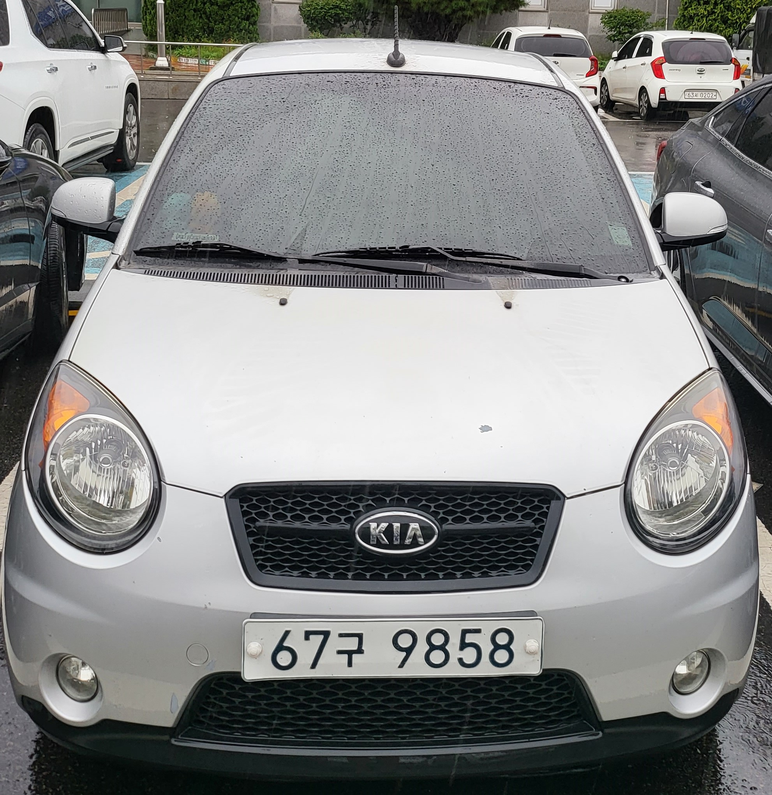
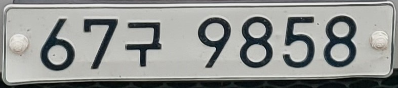

# CarPlateReader
[OpenCV] 자동차 번호판 ROI 크롭 후 OCR로 텍스트 출력
 

## Outline
프로젝트 주제: OpenCV를 활용한 차량 번호판 ROI Crop 및 OCR을 통한 텍스트 출력  
 
프로젝트 수행자: 인텔 엣지AI SW개발자 아카데미 3기 우창민 
 
프로젝트 수행기간: 24/1/29 ~ 24/1/30   

## Prerequisite

[환경설정 방법](https://program-developers-story.tistory.com/68)  

## Input

## Output

OCR 변환 후 "67구9858"

